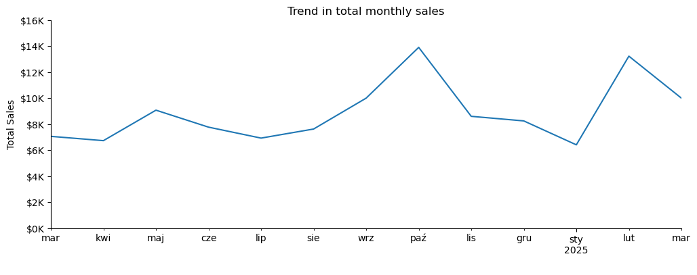

# Overview 

Analysis of sales from vending machines. Designed to analyse purchasing patterns, sales trends and customer preferences in relation to coffee products and to provide recommendations to increase sales

# Data structure overview

The dataset provides detailed information on vending machine coffee sales from March 2024 to the present. It includes daily transactions recorded in a table with 7 columns and 3636 rows.

# Executive summary 

# Insights 
 
Sales peaked in October 2024r reaching $13891.16. Through the following months, a significant decline in sales is noted, until the lowest result, among the range of analysis, was reached in January 2025r with a result of $6398.86. The following month, February 2025, saw another strong increase in sales totalling $13215.48.

This trend was due to a decline in sales of the most popular beverage, the Latte. There was a noticeable decline in the share of sales of this drink from a maximum of 31% in September 2024 to 14% in February 2025. Other beverages did not experience declines during the same period.

The increase in year-end sales is noticeable with dairy drinks, which are more in demand during the fall/winter season. Where it should be noted that they still remain the beverages with the smallest share of the total sales, reaching a maximum of 15% last November.

# Recomendations

Loyalty program