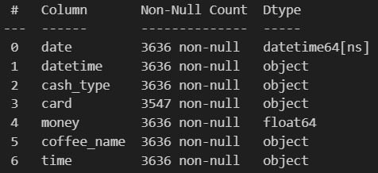

# Overview 

Analysis of vending machine sales. Designed to provide insight into purchasing patterns, sales trends and customer preferences for coffee products. 

# Data structure overview

The dataset provides detailed information on vending machine coffee sales from March 2024 to the present. It includes daily transactions recorded in a table with 6 columns and 3636 rows.

For more details: [link](1.Coffee_Sales_Analysis_EDA.ipynb)

# Executive summary 

This report presents an analysis of coffee sales from vending machines between March 2024 and early 2025. 

The sales peaked in October 2024 at $13,891.16 before experiencing a steady decline, reaching a low of $6,398.86 in January 2025. February 2025 marked a strong rebound with sales rising to $13,215.48. A significant factor behind the earlier drop was a decline in the popularity of key products- Latte and Americano with Milk, both of which saw a sharp reduction in their sales share.

Seasonal trends also revealed increased interest in milk-based beverages during colder months, although they remain the least popular category overall.

Customer loyalty data shows that the majority of users made one-time purchases, while only 94 cards were used for more than five transactions, highlighting an opportunity to enhance customer retention efforts.

# Insights 

### Sales trends: 

 
Sales peaked in October 2024r at $13891.16. The following months saw a significant decline in sales until the lowest result in the analysis range was reached in January 2025r with a result of $6398.86. The following month, February 2025, saw a further sharp increase in turnover to $13215.48.

The negative trend is due to a decline in sales of the most popular drink, the latte. The share of sales of this drink fell from a maximum of 31% in September 2024 to 14% in February 2025. A similar decline in sales was observed for the Americano with Milk, from 29% in September to 19% in February.

The increase in year-end sales is noticeable with dairy drinks, which are more in demand during the fall/winter season. Where it should be noted that they still remain the beverages with the smallest share of the total sales, reaching a maximum of 15% last November.

### Returning customers:
- Number of cards with 1 purchase: 771
- Number of cards with 2-5 purchases: 451
- Number of cards with more than 5 purchases: 94

For more details: [link](2.Coffe_Sales_Trends.ipynb)

# Recomendations

### Targeted promotions for declining products

Sales of lattes and Americanos with milk have declined significantly - consider temporary promotions or new variations of these products to restore their appeal. Further investment is needed to investigate other possible reasons for the decline in sales, such as a drop in quality or more profitable/tastier competitor products.

### Re-engage customers with loyalty programmes

More than 770 cards have only been used once - introducing a loyalty programme (e.g. free coffee every 5th visit, points for purchases) can encourage customers to return and increase the number of transactions per user.

### Seasonal product strategy

Milk drinks are more popular in autumn and winter - you can introduce seasonal flavours (e.g. pumpkin spice, winter vanilla), emphasise their presence with marketing and better display them in the vending machine in colder seasons.

### Product mix optimisation

Since some beverages have a low share of year-round sales: Cortado and Espresso, consider reducing the number of infrequently purchased items and replacing them with better-matched products (e.g., decaffeinated beverages, plant-based alternatives).

